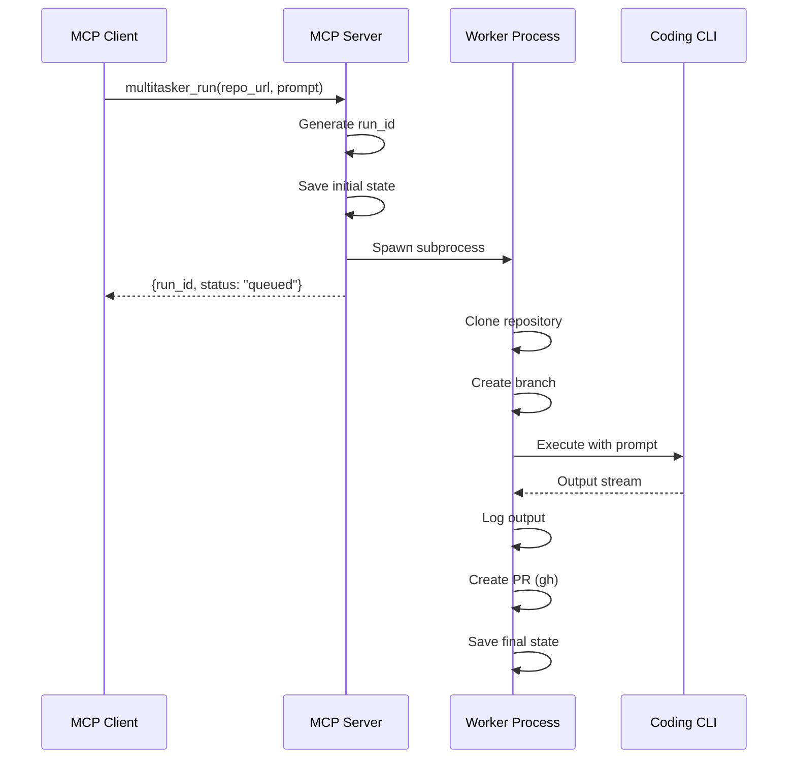
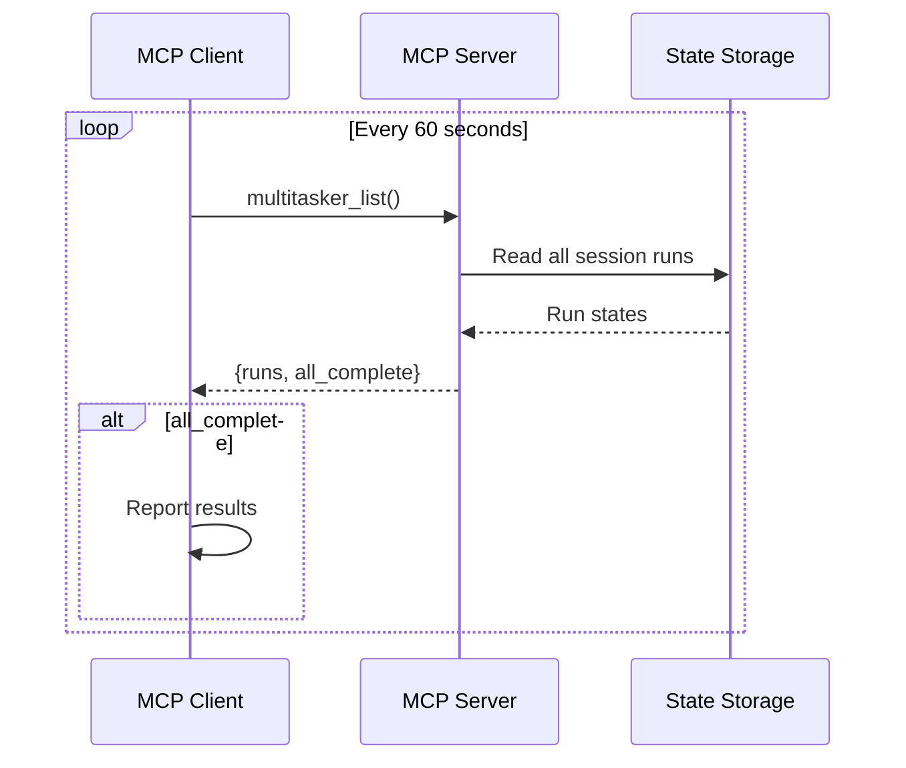
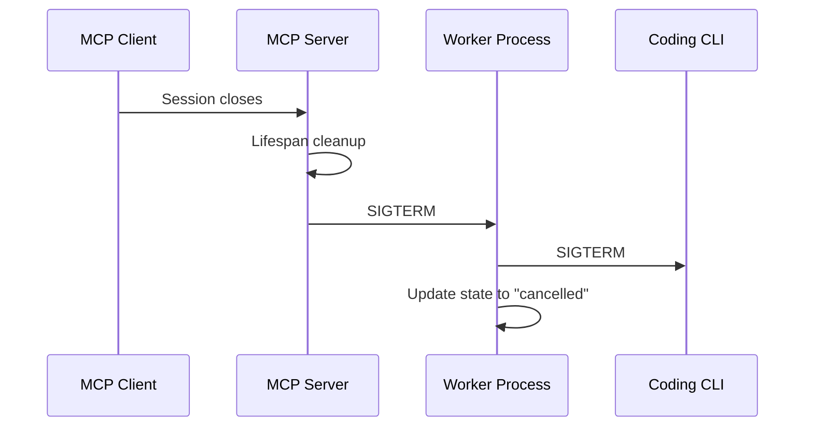

# Architecture

How Co-Task MCP works under the hood.

## Overview

```
┌────────────────────────────────────────────────────────────────┐
│                        MCP Client                               │
│                    (Copilot CLI, etc.)                         │
└────────────────────────────────────────────────────────────────┘
                              │
                              │ stdio (JSON-RPC)
                              ▼
┌────────────────────────────────────────────────────────────────┐
│                        MCP Server                               │
│                       (FastMCP)                                 │
│  ┌──────────────────────────────────────────────────────────┐  │
│  │  Tools: run, list, status, logs, cancel, cleanup, wait   │  │
│  ├──────────────────────────────────────────────────────────┤  │
│  │  Resources: runs, logs, state                            │  │
│  ├──────────────────────────────────────────────────────────┤  │
│  │  Prompts: parallel_tasks                                 │  │
│  └──────────────────────────────────────────────────────────┘  │
└────────────────────────────────────────────────────────────────┘
         │                    │                    │
         │ spawn              │ read/write         │ spawn
         ▼                    ▼                    ▼
┌─────────────┐      ┌─────────────┐      ┌─────────────┐
│   Worker    │      │    State    │      │   Cleanup   │
│  Process    │      │   Storage   │      │   Watcher   │
└─────────────┘      └─────────────┘      └─────────────┘
         │                                         │
         │ spawn                                   │ gh api
         ▼                                         ▼
┌─────────────┐                           ┌─────────────┐
│  Coding CLI │                           │   GitHub    │
│ (co/cx/cc)  │                           │     API     │
└─────────────┘                           └─────────────┘
```

## Components

### MCP Server (`server.py`)

The main entry point, built with FastMCP. Responsibilities:

- **Tool Registration** - Exposes MCP tools for task management
- **Resource Registration** - Exposes logs and state as resources
- **Session Tracking** - Associates tasks with client sessions
- **Lifecycle Management** - Cancels tasks on shutdown

Key features:
- Uses `lifespan` context manager for graceful shutdown
- Tracks worker PIDs for cleanup
- Session-scoped task isolation

### Worker Process (`worker.py`)

Spawned by `subprocess.Popen` with `start_new_session=True` to survive server restarts.

Responsibilities:
- Clone repository to workspace
- Create feature branch
- Execute coding CLI
- Create PR via `gh`
- Update state throughout

Signal handling:
- Registers SIGTERM handler
- Forwards signals to child coding CLI
- Enables graceful cancellation

### Runner (`runner.py`)

Core execution logic for running coding CLIs.

Features:
- Command resolution (co/codex/claude)
- Model selection for Copilot
- Prompt passing via flags or positional args
- Session ID tracking for resume support
- Output streaming to log files

### State Management (`state.py`)

File-based persistence under `~/.multitasker/`.

Structure:
```
~/.multitasker/
├── config.json              # User configuration
├── runs/
│   └── run_{timestamp}_{uuid}/
│       ├── state.json       # Current state
│       ├── events.jsonl     # Event log (append-only)
│       └── run.log          # Agent output
└── workspaces/
    └── run_{uuid}/          # Cloned repository
        └── repo/
```

State fields:
- `run_id` - Unique identifier
- `session_id` - MCP session that created the task
- `status` - Current status
- `request` - Original run request
- `pr_url` - PR URL when created
- `error` - Error message if failed
- `questions` - Pending human-in-the-loop questions

### Cleanup Watcher (`cleanup.py`)

Detached process that monitors PR status and cleans up workspaces.

Behavior:
1. Polls GitHub API for PR merge status
2. When merged, removes workspace directory
3. Updates state with cleanup timestamp
4. Sends notification on completion

## Data Flow

### Starting a Task



### Polling for Status



### Graceful Shutdown



## Process Hierarchy

```
MCP Client (e.g., Copilot CLI)
└── MCP Server (Python, stdio)
    ├── Worker Process 1 (detached)
    │   └── Coding CLI (co/codex/claude)
    ├── Worker Process 2 (detached)
    │   └── Coding CLI
    └── Cleanup Watcher (detached)
```

Key characteristics:
- Workers use `start_new_session=True` for process group isolation
- Workers survive MCP server restarts
- Cleanup watchers are fully detached (persist after everything exits)

## MCP Protocol Features Used

### Tools
- Standard tool registration with Pydantic models
- Tool annotations (readOnlyHint, destructiveHint, idempotentHint)
- Async tools for blocking operations

### Resources
- Dynamic resource URIs (`multitasker://runs/{run_id}/logs`)
- Text content for logs and JSON state

### Prompts
- Parameterized prompts for common workflows
- Used for the `parallel_tasks` template

### Elicitation
- Form-based user input for answering questions
- Supports both multiple choice and free text

### Progress
- Real-time progress notifications during `multitasker_wait`
- Reports completion percentage and status message

### Lifecycle
- Uses FastMCP's `lifespan` context manager
- Cleanup on server shutdown

## Security Considerations

### Session Isolation
- Tasks are associated with the session that created them
- `session_id` from MCP context is stored in state
- All tools filter by session_id to prevent cross-session access

### Graceful Degradation
- Elicitation requires client support (graceful error if unsupported)
- Progress notifications are fire-and-forget
- Missing notifications don't break functionality

### Resource Cleanup
- Workspaces are automatically cleaned after PR merge
- Manual cleanup available via `multitasker_cleanup`
- Shutdown cancels running tasks to prevent orphans
